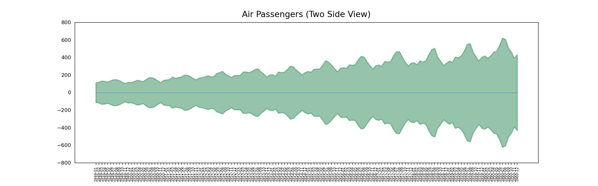

# Python Time Series

<h2> Complete Guide on Time Series Analysis in Python </h2>

As the name implies, this notebook is all about Time Series Analysis. A time series is a series of data points recorded at different time-intervals. The time series analysis means analyzing the time series data using various statistical tools and techniques.

The concepts and code in this notebook is taken from the following websites:

 - [www.kaggle.com](https://www.kaggle.com/code/prashant111/complete-guide-on-time-series-analysis-in-python)
 - [www.machinelearningplus.com](https://www.machinelearningplus.com/time-series/time-series-analysis-python/)
 - [www.towardsdatascience.com](https://towardsdatascience.com/an-end-to-end-project-on-time-series-analysis-and-forecasting-with-python-4835e6bf050b)
 - [www.digitalocean.com](https://www.digitalocean.com/community/tutorials/a-guide-to-time-series-visualization-with-python-3)

Click [here](/time_series.ipynb) to check the notebook

